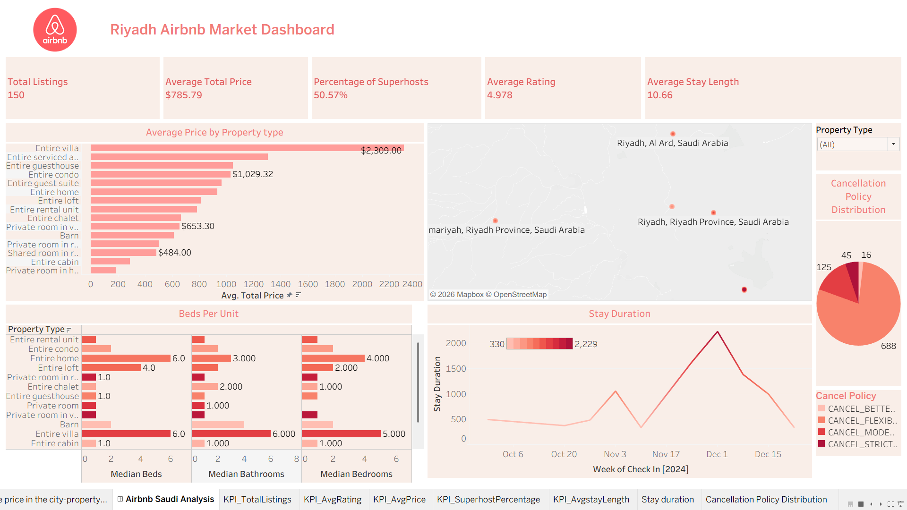

# Riyadh-Airbnb-Dashboard
Interactive data visualization dashboard analyzing Riyadh Airbnb listings, pricing patterns, geographic distribution, host behavior, and market trends using business intelligence and storytelling techniques.

## 📷 Dashboard Preview

# 🏠 Riyadh Airbnb Data Visualization

## 📌 Project Overview

This project presents an interactive Tableau dashboard analyzing the Airbnb rental market in Riyadh, Saudi Arabia.

The dashboard combines data cleaning, KPI reporting, geographic visualization, time-series analysis, and visual storytelling to provide insights into pricing trends, host behavior, and property characteristics.

---

## 📊 Dashboard Features

- Interactive KPI cards
- Average price by property type
- Geographic distribution of listings
- Cancellation policy analysis
- Stay duration trends
- Property feature comparison

---

## 🧹 Data Preparation

The dataset was cleaned by:

- Removing invalid prices
- Standardizing location names
- Handling missing values
- Removing unrealistic records

---

## 🛠 Tools Used

- Tableau
- Excel
- Data Cleaning
- Data Visualization

---

## 👩‍💻 My Contribution

- Cleaned and prepared the dataset
- Designed the dashboard layout
- Created key visualizations
- Performed exploratory analysis
- Contributed to report writing

